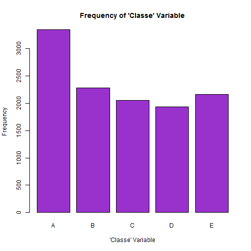
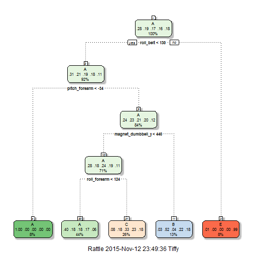

###Executive Summary

Using devices such as Jawbone Up, Nike FuelBand, and Fitbit, it is now possible to collect a large amount of data about personal activity.  For this project, we use the Weight Lifting Exercises data set found at http://groupware.les.inf.puc-rio.br/har.  In this data set, six participants wore accelerometers and were asked to perform barbell lifts correctly and incorrectly in 5 different ways, with Class A being the correct method and Classes B-E using an incorrect method. Our goal is to use data from the Weight Lifting Exercises dataset to predict the manner in which the participants performed the exercise.

###Data Transformation

To begin, download the testing and training data sets and load required packages.  We will set the testing dataset aside for now as it will be used for final validation.


```r
training<-read.csv("https://d396qusza40orc.cloudfront.net/predmachlearn/pml-training.csv",
                   na.strings=c("NA","#DIV/0!", ""))
testing<-read.csv("https://d396qusza40orc.cloudfront.net/predmachlearn/pml-testing.csv",
                  na.strings=c("NA","#DIV/0!", ""))
library(AppliedPredictiveModeling)
library(caret)
library(randomForest)
library(rattle)
str(training)
```

```
## 'data.frame':	19622 obs. of  160 variables:
##  $ X                       : int  1 2 3 4 5 6 7 8 9 10 ...
##  $ user_name               : Factor w/ 6 levels "adelmo","carlitos",..: 2 2 2 2 2 2 2 2 2 2 ...
##  $ raw_timestamp_part_1    : int  1323084231 1323084231 1323084231 1323084232 1323084232 1323084232 1323084232 1323084232 1323084232 1323084232 ...
##  $ raw_timestamp_part_2    : int  788290 808298 820366 120339 196328 304277 368296 440390 484323 484434 ...
##  $ cvtd_timestamp          : Factor w/ 20 levels "02/12/2011 13:32",..: 9 9 9 9 9 9 9 9 9 9 ...
##  $ new_window              : Factor w/ 2 levels "no","yes": 1 1 1 1 1 1 1 1 1 1 ...
##  $ num_window              : int  11 11 11 12 12 12 12 12 12 12 ...
##  $ roll_belt               : num  1.41 1.41 1.42 1.48 1.48 1.45 1.42 1.42 1.43 1.45 ...
##  $ pitch_belt              : num  8.07 8.07 8.07 8.05 8.07 8.06 8.09 8.13 8.16 8.17 ...
##  $ yaw_belt                : num  -94.4 -94.4 -94.4 -94.4 -94.4 -94.4 -94.4 -94.4 -94.4 -94.4 ...
##  $ total_accel_belt        : int  3 3 3 3 3 3 3 3 3 3 ...
##  $ kurtosis_roll_belt      : num  NA NA NA NA NA NA NA NA NA NA ...
##  $ kurtosis_picth_belt     : num  NA NA NA NA NA NA NA NA NA NA ...
##  $ kurtosis_yaw_belt       : logi  NA NA NA NA NA NA ...
##  $ skewness_roll_belt      : num  NA NA NA NA NA NA NA NA NA NA ...
##  $ skewness_roll_belt.1    : num  NA NA NA NA NA NA NA NA NA NA ...
##  $ skewness_yaw_belt       : logi  NA NA NA NA NA NA ...
##  $ max_roll_belt           : num  NA NA NA NA NA NA NA NA NA NA ...
##  $ max_picth_belt          : int  NA NA NA NA NA NA NA NA NA NA ...
##  $ max_yaw_belt            : num  NA NA NA NA NA NA NA NA NA NA ...
##  $ min_roll_belt           : num  NA NA NA NA NA NA NA NA NA NA ...
##  $ min_pitch_belt          : int  NA NA NA NA NA NA NA NA NA NA ...
##  $ min_yaw_belt            : num  NA NA NA NA NA NA NA NA NA NA ...
##  $ amplitude_roll_belt     : num  NA NA NA NA NA NA NA NA NA NA ...
##  $ amplitude_pitch_belt    : int  NA NA NA NA NA NA NA NA NA NA ...
##  $ amplitude_yaw_belt      : num  NA NA NA NA NA NA NA NA NA NA ...
##  $ var_total_accel_belt    : num  NA NA NA NA NA NA NA NA NA NA ...
##  $ avg_roll_belt           : num  NA NA NA NA NA NA NA NA NA NA ...
##  $ stddev_roll_belt        : num  NA NA NA NA NA NA NA NA NA NA ...
##  $ var_roll_belt           : num  NA NA NA NA NA NA NA NA NA NA ...
##  $ avg_pitch_belt          : num  NA NA NA NA NA NA NA NA NA NA ...
##  $ stddev_pitch_belt       : num  NA NA NA NA NA NA NA NA NA NA ...
##  $ var_pitch_belt          : num  NA NA NA NA NA NA NA NA NA NA ...
##  $ avg_yaw_belt            : num  NA NA NA NA NA NA NA NA NA NA ...
##  $ stddev_yaw_belt         : num  NA NA NA NA NA NA NA NA NA NA ...
##  $ var_yaw_belt            : num  NA NA NA NA NA NA NA NA NA NA ...
##  $ gyros_belt_x            : num  0 0.02 0 0.02 0.02 0.02 0.02 0.02 0.02 0.03 ...
##  $ gyros_belt_y            : num  0 0 0 0 0.02 0 0 0 0 0 ...
##  $ gyros_belt_z            : num  -0.02 -0.02 -0.02 -0.03 -0.02 -0.02 -0.02 -0.02 -0.02 0 ...
##  $ accel_belt_x            : int  -21 -22 -20 -22 -21 -21 -22 -22 -20 -21 ...
##  $ accel_belt_y            : int  4 4 5 3 2 4 3 4 2 4 ...
##  $ accel_belt_z            : int  22 22 23 21 24 21 21 21 24 22 ...
##  $ magnet_belt_x           : int  -3 -7 -2 -6 -6 0 -4 -2 1 -3 ...
##  $ magnet_belt_y           : int  599 608 600 604 600 603 599 603 602 609 ...
##  $ magnet_belt_z           : int  -313 -311 -305 -310 -302 -312 -311 -313 -312 -308 ...
##  $ roll_arm                : num  -128 -128 -128 -128 -128 -128 -128 -128 -128 -128 ...
##  $ pitch_arm               : num  22.5 22.5 22.5 22.1 22.1 22 21.9 21.8 21.7 21.6 ...
##  $ yaw_arm                 : num  -161 -161 -161 -161 -161 -161 -161 -161 -161 -161 ...
##  $ total_accel_arm         : int  34 34 34 34 34 34 34 34 34 34 ...
##  $ var_accel_arm           : num  NA NA NA NA NA NA NA NA NA NA ...
##  $ avg_roll_arm            : num  NA NA NA NA NA NA NA NA NA NA ...
##  $ stddev_roll_arm         : num  NA NA NA NA NA NA NA NA NA NA ...
##  $ var_roll_arm            : num  NA NA NA NA NA NA NA NA NA NA ...
##  $ avg_pitch_arm           : num  NA NA NA NA NA NA NA NA NA NA ...
##  $ stddev_pitch_arm        : num  NA NA NA NA NA NA NA NA NA NA ...
##  $ var_pitch_arm           : num  NA NA NA NA NA NA NA NA NA NA ...
##  $ avg_yaw_arm             : num  NA NA NA NA NA NA NA NA NA NA ...
##  $ stddev_yaw_arm          : num  NA NA NA NA NA NA NA NA NA NA ...
##  $ var_yaw_arm             : num  NA NA NA NA NA NA NA NA NA NA ...
##  $ gyros_arm_x             : num  0 0.02 0.02 0.02 0 0.02 0 0.02 0.02 0.02 ...
##  $ gyros_arm_y             : num  0 -0.02 -0.02 -0.03 -0.03 -0.03 -0.03 -0.02 -0.03 -0.03 ...
##  $ gyros_arm_z             : num  -0.02 -0.02 -0.02 0.02 0 0 0 0 -0.02 -0.02 ...
##  $ accel_arm_x             : int  -288 -290 -289 -289 -289 -289 -289 -289 -288 -288 ...
##  $ accel_arm_y             : int  109 110 110 111 111 111 111 111 109 110 ...
##  $ accel_arm_z             : int  -123 -125 -126 -123 -123 -122 -125 -124 -122 -124 ...
##  $ magnet_arm_x            : int  -368 -369 -368 -372 -374 -369 -373 -372 -369 -376 ...
##  $ magnet_arm_y            : int  337 337 344 344 337 342 336 338 341 334 ...
##  $ magnet_arm_z            : int  516 513 513 512 506 513 509 510 518 516 ...
##  $ kurtosis_roll_arm       : num  NA NA NA NA NA NA NA NA NA NA ...
##  $ kurtosis_picth_arm      : num  NA NA NA NA NA NA NA NA NA NA ...
##  $ kurtosis_yaw_arm        : num  NA NA NA NA NA NA NA NA NA NA ...
##  $ skewness_roll_arm       : num  NA NA NA NA NA NA NA NA NA NA ...
##  $ skewness_pitch_arm      : num  NA NA NA NA NA NA NA NA NA NA ...
##  $ skewness_yaw_arm        : num  NA NA NA NA NA NA NA NA NA NA ...
##  $ max_roll_arm            : num  NA NA NA NA NA NA NA NA NA NA ...
##  $ max_picth_arm           : num  NA NA NA NA NA NA NA NA NA NA ...
##  $ max_yaw_arm             : int  NA NA NA NA NA NA NA NA NA NA ...
##  $ min_roll_arm            : num  NA NA NA NA NA NA NA NA NA NA ...
##  $ min_pitch_arm           : num  NA NA NA NA NA NA NA NA NA NA ...
##  $ min_yaw_arm             : int  NA NA NA NA NA NA NA NA NA NA ...
##  $ amplitude_roll_arm      : num  NA NA NA NA NA NA NA NA NA NA ...
##  $ amplitude_pitch_arm     : num  NA NA NA NA NA NA NA NA NA NA ...
##  $ amplitude_yaw_arm       : int  NA NA NA NA NA NA NA NA NA NA ...
##  $ roll_dumbbell           : num  13.1 13.1 12.9 13.4 13.4 ...
##  $ pitch_dumbbell          : num  -70.5 -70.6 -70.3 -70.4 -70.4 ...
##  $ yaw_dumbbell            : num  -84.9 -84.7 -85.1 -84.9 -84.9 ...
##  $ kurtosis_roll_dumbbell  : num  NA NA NA NA NA NA NA NA NA NA ...
##  $ kurtosis_picth_dumbbell : num  NA NA NA NA NA NA NA NA NA NA ...
##  $ kurtosis_yaw_dumbbell   : logi  NA NA NA NA NA NA ...
##  $ skewness_roll_dumbbell  : num  NA NA NA NA NA NA NA NA NA NA ...
##  $ skewness_pitch_dumbbell : num  NA NA NA NA NA NA NA NA NA NA ...
##  $ skewness_yaw_dumbbell   : logi  NA NA NA NA NA NA ...
##  $ max_roll_dumbbell       : num  NA NA NA NA NA NA NA NA NA NA ...
##  $ max_picth_dumbbell      : num  NA NA NA NA NA NA NA NA NA NA ...
##  $ max_yaw_dumbbell        : num  NA NA NA NA NA NA NA NA NA NA ...
##  $ min_roll_dumbbell       : num  NA NA NA NA NA NA NA NA NA NA ...
##  $ min_pitch_dumbbell      : num  NA NA NA NA NA NA NA NA NA NA ...
##  $ min_yaw_dumbbell        : num  NA NA NA NA NA NA NA NA NA NA ...
##  $ amplitude_roll_dumbbell : num  NA NA NA NA NA NA NA NA NA NA ...
##   [list output truncated]
```

A review of the structure of the training set reveals a large number of missing values, which we remove.  We also remove the first seven columns of the data set as not relevant to our review since the person performing the maneuver or the time it was performed should not impact the class to which the activity belongs.  Finally, we divide the cleaned training set into two new datasets for cross-validation purposes.  We split the data based on the "classe" variable and create a new training set using 60% of the original data, with the remaining 40% of the data split onto a new testing set.


```r
trainingnoNA<-training[,colSums(is.na(training))==0]
testingnoNA<-testing[,colSums(is.na(testing))==0]

trainingnoNA<-trainingnoNA[,-c(1:7)]
testingnoNA<-testingnoNA[,-c(1:7)]

inTrain<-createDataPartition(y=trainingnoNA$classe,p=0.6,list=FALSE)
newtrain<-trainingnoNA[inTrain,]
newtest<-trainingnoNA[-inTrain,]
```

Before beginning our modeling, let's check the frequency of the appearance of Classes A-E.  If there is severe imbalance, weighting may need to be considered.  It would also be difficult to make an accurate model if one of the classes has little to no appearance in our new training data set.


```r
plot(newtrain$classe,main="Frequency of 'Classe' Variable",xlab="'Classe' Variable",ylab="Frequency",col="darkorchid")
```

 

Per our histogram, Class A appears most frequently, with the other variables all having a strong showing in our training data set.  With these frequencies, accurate model prediction for each variable should not be difficult to achieve.  The histogram also gives us a basic idea of what we can expect to see when running our final model on the test/validation data set.

###Model Creation

Let's begin with a basic classification tree model.  We have 52 variables to consider (with column 53 being our 'classe' variable), therefore our initial model with all variables included will most likely not be our final model due to potential variable correlation.  Since we are trying to predict class type, let's start with the rpart method.


```r
dim(newtrain)
```

```
## [1] 11776    53
```

```r
set.seed(777)
modFitstart <- train(classe ~ .,method="rpart",data=newtrain)
fancyRpartPlot(modFitstart$finalModel)
```

 

Using the rattle package, we can make a dendrogram that shows the predicted class selection based on the rpart model.  However, one big issue sticks out from this plot - given the frequencies in our histogram, how is it not possible to reach class D as an outcome using this method?  A review of model accuracy shows that the rpart method using all available variables is little better than random chance guessing.  Pretty classification trees do not indicate accuracy, and this is not the model for us.


```r
modFitstart
```

```
## CART 
## 
## 11776 samples
##    52 predictor
##     5 classes: 'A', 'B', 'C', 'D', 'E' 
## 
## No pre-processing
## Resampling: Bootstrapped (25 reps) 
## Summary of sample sizes: 11776, 11776, 11776, 11776, 11776, 11776, ... 
## Resampling results across tuning parameters:
## 
##   cp          Accuracy   Kappa       Accuracy SD  Kappa SD  
##   0.03595159  0.5013517  0.34885908  0.01135583   0.01777647
##   0.06015662  0.4344590  0.23693552  0.06476363   0.10847863
##   0.11556716  0.3256272  0.06005769  0.04188545   0.06384244
## 
## Accuracy was used to select the optimal model using  the largest value.
## The final value used for the model was cp = 0.03595159.
```

Let's use the caret package's preprocessing abilities to help in our model building.  All 52 variables may not be necessary - instead, we can eliminate some redundant variables that may unnecessarily complicate our model.  Only those features that impact class variability should be considered.


```r
preProc<-preProcess(newtrain[,-53],method="pca",thresh=0.95)
preProc
```

```
## Created from 11776 samples and 52 variables
## 
## Pre-processing:
##   - centered (52)
##   - ignored (0)
##   - principal component signal extraction (52)
##   - scaled (52)
## 
## PCA needed 26 components to capture 95 percent of the variance
```

Per the above principal component analysis, only 26 components are needed to capture 95% of the variance.  Since we only want to use relevant features, we remove those variables that aren't useful, may lead to overfitting, or may otherwise mislead our final results.


```r
predtrain<-predict(preProc,newtrain[,-53])
```

Since it is accuracy we want, perhaps the best method to use is Random Forest as it is one of the best performing algorithms for prediction purposes.  The authors of the original paper** also use the random forest method in their review.  If running the below code, please be aware that this does take some computational time to run.


```r
set.seed(777)
modFit<-train(newtrain$classe~.,data=predtrain,method="rf",trControl=trainControl(method="cv"),importance=TRUE)
modFit$finalModel
```

```
## 
## Call:
##  randomForest(x = x, y = y, mtry = param$mtry, importance = TRUE) 
##                Type of random forest: classification
##                      Number of trees: 500
## No. of variables tried at each split: 2
## 
##         OOB estimate of  error rate: 3.06%
## Confusion matrix:
##      A    B    C    D    E class.error
## A 3317   15    9    5    2 0.009259259
## B   47 2180   47    2    3 0.043440105
## C    3   35 1992   18    6 0.030185005
## D    3    0  107 1816    4 0.059067358
## E    2   10   28   14 2111 0.024942263
```

Our results of the random forest method show excellent accuracy, with an OOB error rate of 3%.  Although we assume this to be slightly underestimated when applied to the testing set, we should still be within our 95% accuracy goal.

Since the training and test sets must be preprocessed in the same way for cross-validation purposes, we use the same preprocessing techniques on the test set as used on the training set.  We then run a confusion matrix to see how well our model performs on the testing data set we created in the Data Transformation section.


```r
predtest <- predict(preProc,newtest[,-53])
confusion<-confusionMatrix(newtest$classe,predict(modFit,predtest))
confusion
```

```
## Confusion Matrix and Statistics
## 
##           Reference
## Prediction    A    B    C    D    E
##          A 2216    7    5    2    2
##          B   37 1450   28    0    3
##          C    0   31 1319   16    2
##          D    2    2   49 1225    8
##          E    3    7    7    7 1418
## 
## Overall Statistics
##                                           
##                Accuracy : 0.9722          
##                  95% CI : (0.9683, 0.9757)
##     No Information Rate : 0.2878          
##     P-Value [Acc > NIR] : < 2.2e-16       
##                                           
##                   Kappa : 0.9648          
##  Mcnemar's Test P-Value : 4.064e-07       
## 
## Statistics by Class:
## 
##                      Class: A Class: B Class: C Class: D Class: E
## Sensitivity            0.9814   0.9686   0.9368   0.9800   0.9895
## Specificity            0.9971   0.9893   0.9924   0.9908   0.9963
## Pos Pred Value         0.9928   0.9552   0.9642   0.9526   0.9834
## Neg Pred Value         0.9925   0.9926   0.9863   0.9962   0.9977
## Prevalence             0.2878   0.1908   0.1795   0.1593   0.1826
## Detection Rate         0.2824   0.1848   0.1681   0.1561   0.1807
## Detection Prevalence   0.2845   0.1935   0.1744   0.1639   0.1838
## Balanced Accuracy      0.9893   0.9789   0.9646   0.9854   0.9929
```

Our results appear to be solid, with most predictions falling squarely in the correct class.  Our accuracy rate is 97.2%, and our out of sample error rate is 1-accuracy, or 2.8%.

###Final Results

The final step of our project is to take the 20 test cases set aside as a test/validation set and submit them for automatic review.  Let's run our machine learning algorithm on the 20 test cases and see how we did:


```r
finalpredict<-predict(preProc,testingnoNA)
finalresults<-predict(modFit,finalpredict)
finalresults
```

```
##  [1] B A C A A E D B A A B C B A E E A B B B
## Levels: A B C D E
```


```r
pml_write_files = function(x){
  n = length(x)
  for(i in 1:n){
    filename = paste0("problem_id_",i,".txt")
    write.table(x[i],file=filename,quote=FALSE,row.names=FALSE,col.names=FALSE)
  }
}
pml_write_files(finalresults)
```

19/20 is our final result - not too bad!  While we could finesse our model to include more variables, thereby to potentially produce perfect results, these results fall within our desired 95% accuracy rating. 


**Source:  Velloso, E.; Bulling, A.; Gellersen, H.; Ugulino, W.; Fuks, H. Qualitative Activity Recognition of Weight Lifting Exercises. Proceedings of 4th International Conference in Cooperation with SIGCHI (Augmented Human '13) . Stuttgart, Germany: ACM SIGCHI, 2013.

